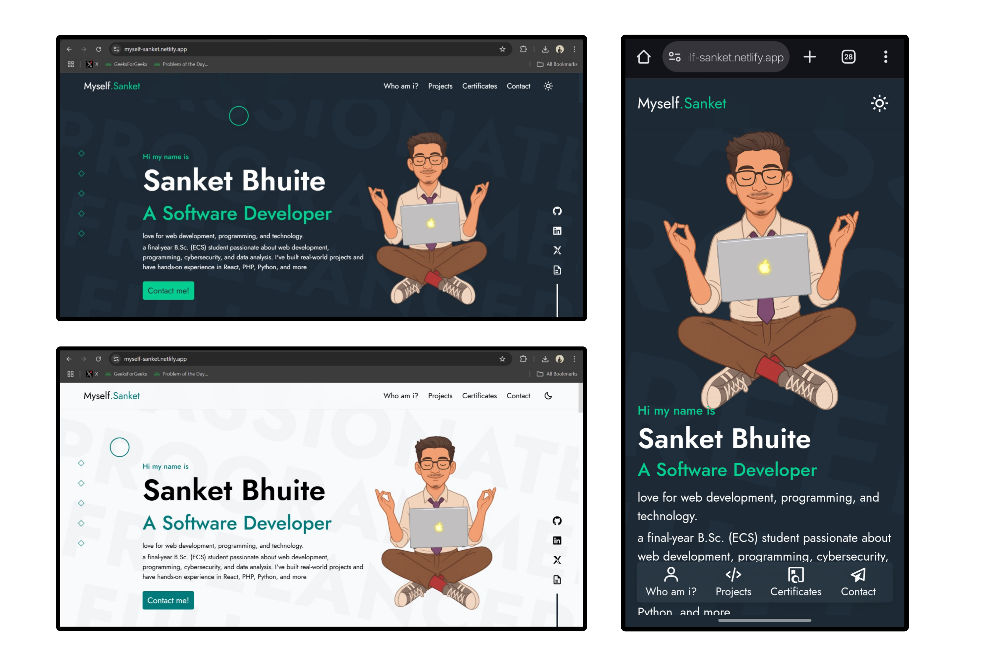

# 🌐 Myself Sanket – Personal Portfolio  

Welcome to the repository of my **personal portfolio website** 🎨  
🚀 **Live Website**: [myself-sanket.netlify.app](https://myself-sanket.netlify.app)

---

## 📌 About  
This portfolio is my digital space to showcase:  
- 💼 **Projects** I’ve built  
- 📜 **Certificates & Achievements**  
- 📚 **Skills & Experience**  
- 📩 **Contact Information**

---

## 🛠️ Tech Stack  
- **Framework**: Next.js 13  
- **Styling**: Tailwind CSS  
- **Deployment**: Netlify  
- **Version Control**: Git + GitHub  

---

## ⚡ Features  
✅ **Responsive UI** – Works across devices  
✅ **Projects Section** – Linked with GitHub APIs  
✅ **Certificates Page** – Showcasing all awards & achievements  
✅ **Smooth Animations** – Better experience & design  

---

## 📸 Preview  

---

## 📬 Contact Me  
- **LinkedIn** – [Sanket Bhuite](https://linkedin.com/in/sanketbhuite)  
- **GitHub** – [@sanketbhuite](https://github.com/sanketbhuite)  

---

> 💬 *“Talk is cheap. Show me the code.” – Linus Torvalds*
